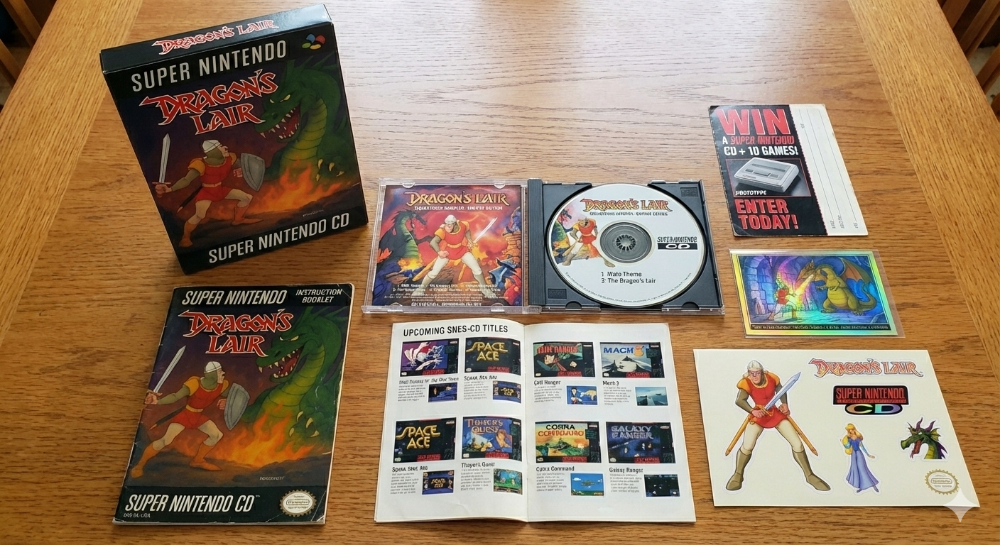

# Super Dragon's Lair Arcade (SNES)



**Super Dragon's Lair Arcade** is a full-motion-video (FMV) retheme of RoadBlaster for the Super Nintendo Entertainment System, targeting real NTSC SNES hardware with MSU-1 audio/video on SD2SNES/FXPAK Pro.

This faithful recreation of the 1983 arcade classic brings the legendary laserdisc adventure to your SNES console, complete with authentic packaging and documentation reminiscent of the 16-bit era.

## What's in the Box

Your complete Super Dragon's Lair Arcade package includes:

- **Game Cartridge** - The SNES ROM with MSU-1 enhancement chip support
- **User Manual** - Complete 4-page instruction booklet with story, controls, and survival guide
- **Holographic Trading Card** - Collectible card featuring Dirk the Daring
- **Soundtrack CD** - Original arcade audio tracks in CD quality
- **Sticker Sheet** - Dragon's Lair themed stickers
- **Warranty Card** - Official product registration
- **Upcoming Releases Preview** - Sneak peek at future titles

> [!NOTE]
> All schwag materials are available in the [`schwag/`](schwag) directory for your enjoyment and nostalgia.

## Current Status

- **MSU-1 Video Pipeline Complete** — All 516 chapters converted to SNES tile data (~568 MB `.msu` file) with RGB-space tile reduction (768 tiles merged to 512 per frame)
- **All 29 Scenes Playable** — 9 levels spanning introduction through the dragon's lair, with full chapter-to-chapter transitions driven by player input
- **Title Screen with Full Menu System** — Start Game, Options submenu (High Scores, Attract Mode, Sound Test, Scene Select)
- **Scene Select** — Jump to any of the 29 scenes directly from the title screen
- **Attract Mode** — Automated demo playback of game chapters
- **Chapter/Event System** — Data-table architecture with 36+ event classes, `xmlsceneparser.py` generates assembly from 516 XML chapter definitions
- **Complete Boot Sequence** — Boot → MSU-1 init → losers screen → logo intro → title screen → gameplay
- **SPC700 Audio** — 6 sound effects in BRR format within the 57.5 KB sample RAM budget
- **Dragon's Lair Themed Assets** — Backgrounds, sprites, and UI elements themed for the arcade experience

## Scope and Goals
- Recreate the Dragon's Lair arcade experience on the SNES while retaining the RoadBlaster MSU-1 FMV engine
- Replace all RoadBlaster assets with Dragon's Lair equivalents (video, audio, sprites, UI, prompts) while preserving arcade timings and cues
- Produce a fully playable SNES ROM plus MSU-1 data set for real hardware

## Build at a Glance

### Requirements
- **OS:** Linux/WSL (Ubuntu) or Windows with WSL
- **Assembler:** WLA-DX 9.3 (pre-built binaries included in `tools/wla-dx-9.5-svn/`)
- **Python:** Python 3.10+ with Pillow and NumPy
  ```bash
  pip install -r requirements.txt
  ```

### Build Commands
```bash
# Standard build (clean + build, ~2-3 min)
wsl -e bash -c "cd /mnt/e/gh/SNES-SuperDragonsLairArcade && make clean && make"

# Fast rebuild (skip clean if only .65816/.script files changed)
wsl -e bash -c "cd /mnt/e/gh/SNES-SuperDragonsLairArcade && make"
```

> [!WARNING]
> `make clean` deletes `data/chapters/` — this wipes all extracted video frames. Use `make` without `clean` if you need to preserve them.

**Output:** ROM binary at `build/SuperDragonsLairArcade.sfc` (1 MB, 16 banks, HiROM+FastROM)

### MSU-1 Video Data Generation
```bash
# Generate .msu video data (~23 min with 8 workers, requires existing PNG frames)
wsl -e bash -c "cd /mnt/e/gh/SNES-SuperDragonsLairArcade && python3 tools/generate_msu_data.py --skip-extract --workers 8"

# Full pipeline including frame extraction (~1hr+ first time, uses ffmpeg CUDA)
wsl -e bash -c "cd /mnt/e/gh/SNES-SuperDragonsLairArcade && python3 tools/generate_msu_data.py --workers 8"
```

**See [`BUILD.md`](BUILD.md) for detailed build instructions and troubleshooting.**

## Documentation Map
- `README.md` (this file) — Project overview and status
- **[`BUILD.md`](BUILD.md)** — Build instructions, troubleshooting, and ROM bank reference
- **[`QUICKREF.md`](QUICKREF.md)** — Quick reference card for common commands
- `src/README.md` — Boot/title/score/MSU1 script flow and architecture
- `tools/README.md` — Asset pipeline tools and MSU-1 video generation
- `data/backgrounds/README.md` — Background asset status
- `data/sprites/README.md` — Sprite inventory and descriptions
- `data/sounds/README.md` — Sound system and asset documentation
- `data/events/README.md` — Chapter XML reference
- `data/chapter_event_inventory.md` — Event coverage tracking (516 chapters)

## Hardware Targets
- NTSC Super Nintendo hardware
- SD2SNES / FXPAK Pro (MSU-1 required for video playback)
- Mesen 2, SNES9x, bsnes for debugging and iteration

## Graphics Workflow Quick Reference

```bash
# Step 1: Prepare artwork (resize + quantize to 16 colors)
python tools/img_processor.py \
  --input source_artwork.png \
  --output data/backgrounds/name.gfx_bg/name.gfx_bg.png \
  --width 256 --height 224 --mode cover --colors 16

# Step 2: Build (automatic conversion)
make

# Output: build/data/backgrounds/name.gfx_bg.animation
```

See `tools/README.md` for detailed documentation.

## License
This project includes no commercial Dragon's Lair assets. All extracted assets must be supplied by the user. This repository contains engine code and converter tools only.
