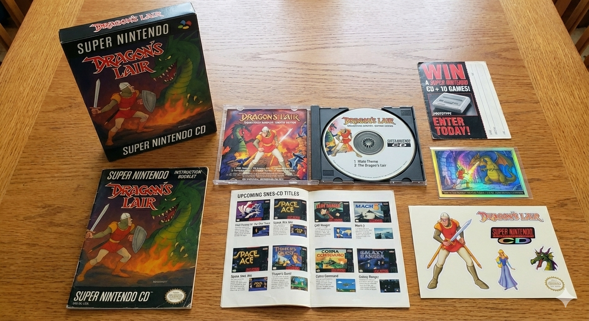

# Super Dragon's Lair Arcade - Schwag & Collectibles

This directory contains all the authentic packaging and promotional materials that would have shipped with Super Dragon's Lair Arcade if it had been released as a physical SNES product in the mid-1990s.

## Complete Package

Everything laid out on the table, just like unboxing day!

## Individual Items

### User Manual

**4-Page Instruction Booklet** featuring:
- The Legend Begins (Story & Characters)
- Arcade-Style Controls
- FMV Cue Guide & Timing Tips
- Survival Guide with Scene Cheats

*Full text available in [`usermanual.txt`](usermanual.txt)*

---

### Holographic Trading Card

Premium collectible featuring Dirk the Daring with authentic 90s-era holographic foil finish.

---

### Soundtrack CD

Original arcade audio tracks in CD quality, enhanced with MSU-1 streaming audio technology.

---

### Sticker Sheet

Dragon's Lair themed stickers featuring characters and iconic scenes from the game.

---

### Warranty Card

Official product registration and warranty information card.

---

### Upcoming Releases

Preview of future releases and other titles in the series.

---

## About These Materials

These schwag items were created to evoke the nostalgia of opening a new SNES game in the 1990s. They represent what a hypothetical physical release of this homebrew project might have looked like during the 16-bit era.

All materials are fan-made and created for this open-source project. Dragon's Lair is a registered trademark of Digital Leisure, Inc.

---

*Back to [Main README](../README.md)*
