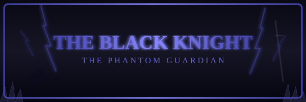

# THE BLACK KNIGHT

**The Phantom Guardian**

*   **Also Known As:** The Phantom Knight
*   **Armor:** Jet-black plate, electrified
*   **Weapon:** Greatsword
*   **Mount:** A massive black warhorse
*   **Abilities:** Swordsmanship, Electrical Immunity, Summoning Thorns
*   **Weakness:** Disarm him, and the phantom dissipates

---

### A Knight of Shadow

The Black Knight is one of the most terrifying guardians in Singe's castle -- a towering figure clad head-to-toe in jet-black armor, mounted atop a dark warhorse that charges through the halls with thundering hooves. No one knows if there is a living man beneath that helm, or if the armor itself is the creature.

Legend says the Black Knight was once a champion of King Ethelred's own court -- a proud warrior who fell under Mordroc's spell and was transformed into a phantom sentinel, cursed to guard the castle's passages for eternity. He keeps two savage hounds at his side and answers to no master but the dark magic that binds him.

### The Duel

When Dirk enters his domain, the Black Knight wastes no time. He charges on horseback, greatsword raised, as giant thorns erupt from the ground to block any retreat. The floor crackles with electrical energy, and the walls themselves seem to conspire against you. His swings are heavy and relentless, each one powerful enough to cleave through stone.

### How to Survive

The Black Knight appears invulnerable -- but there is a secret. His power flows from his armor. If Dirk can land a decisive blow to disarm him, the enchanted plate will shatter apart and the phantom within will dissipate into nothing.

**Strategy:** Parry his blows and watch for openings! The electrical hazards in the room are deadly, but they may also be the key to his undoing. Stay mobile, time your strikes, and do not let his warhorse trample you!
