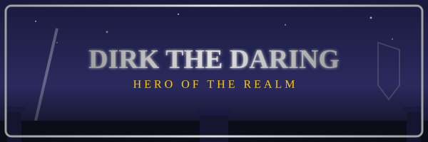

# DIRK THE DARING

**Hero of the Realm**

*   **Occupation:** Knight in service to King Ethelred
*   **Weapon:** Sword (and sheer dumb luck)
*   **Armor:** Grey plate with red-orange tunic
*   **Strengths:** Courage, Agility, Determination, Heart
*   **Weaknesses:** Clumsiness, Fire, Gravity, Small Rocks
*   **Voice:** Mostly screams and the occasional "Wow!"

---

### The Unlikely Hero

Dirk the Daring is not your typical knight in shining armor. He stumbles. He yelps. He flails his arms when he falls. But beneath all that clumsy charm beats the heart of the bravest man in the kingdom. As animator Don Bluth once said, Dirk is an everyman who bumbles his way through everything -- and that is exactly what makes him a hero worth cheering for.

A loyal knight in King Ethelred's court, Dirk had already won the heart of Princess Daphne when the dragon Singe descended upon the kingdom. While other suitors -- brave knights and wealthy princes alike -- had courted Daphne with riches and titles, she chose the humble, awkward knight who made her laugh.

### Into the Dragon's Castle

When Singe kidnapped Daphne and imprisoned her in the deepest chambers of his castle, Dirk did not hesitate. Armed with nothing but his trusty sword and whatever courage he could muster, he marched alone through the castle gates. No army at his back. No magic at his disposal. Just a knight, a blade, and the love of a Princess.

### What You're Working With

Dirk is fast on his feet and surprisingly strong -- he can leap great distances, climb sheer walls, and survive punishment that would fell a lesser man. He cannot cast spells or call upon divine powers. His only tools are his sword, his reflexes, and your timing. Guide him well, and he will overcome every trap, monster, and horror that the castle throws at him. Guide him poorly, and... well, you will see many creative ways for a knight to meet his end.

He may scream, he may trip, but he never gives up!
