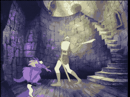

# THE GIDDY GOONS

**The Laughing Menace**

*   **Species:** Purple animalistic creatures
*   **Numbers:** Far too many
*   **Weapons:** Daggers, clubs, sheer weight of numbers
*   **Sound:** Monkey-like screeching and cackling
*   **Danger Level:** Low (alone), Lethal (in packs)
*   **Variants:** Warriors (crossbows), Fire Goons (flaming daggers)

---

### The Swarm

You will hear them before you see them -- a chorus of shrill, monkey-like cackling echoing up the stairwell. Then the first purple shape drops from above, dagger gleaming. Then another. And another. The Giddy Goons hunt in packs, and their favorite tactic is ambush.

These small, feral creatures infest the narrow spiral staircases and corridors of Singe's castle. Individually, a Giddy Goon is no match for a knight -- one swing of Dirk's sword can cleave them in two. But they never attack alone. They pour from doorways, drop from ledges above, and surge from the darkness below, daggers and clubs swinging wildly. Their screeching laughter grows louder the closer they get.

### Strength in Numbers

What the Goons lack in size and skill, they make up for in relentless aggression. They will try to surround you, cutting off retreat, pressing in from every direction. A moment's hesitation is all they need to drag a knight down. Some Goon variants carry crossbows and fire from a distance, while others wield flaming daggers that burn through armor.

### Fight or Flee

There is no reasoning with the Giddy Goons. There is no sneaking past them. The only way through is through -- sword swinging, feet moving, never stopping.

**Strategy:** Keep moving forward! Strike the moment they appear and do not let them surround you. The staircase is narrow -- use that to your advantage and fight them in a line, not a circle. If you stop, you die. Simple as that!
