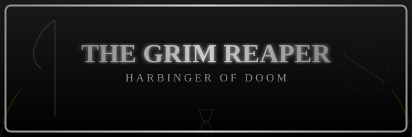
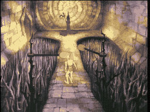

# THE GRIM REAPER

**The Shapeshifter -- Harbinger of Doom**

*   **Also Known As:** The Shapeshifter, Cloaked Spectre, Thorn Lord
*   **Weapon:** Scythe / Halberd
*   **Location:** The Hall of Thorns
*   **Abilities:** Death Touch, Thorn Summoning, Electrical Bolts, Whirling Batons
*   **Master:** Mordroc the Wizard

---

### Death Awaits

A hooded figure floats in the darkness ahead, featureless beneath its pointed cowl, a gleaming halberd gripped in skeletal hands. This is the Shapeshifter -- a spectral entity that serves as Mordroc's most feared assassin. The castle guards call it the Grim Reaper, and for good reason: those who meet its gaze do not return.

The Reaper has haunted these halls since long before Singe claimed the castle. Some say it was here before the castle itself -- an ancient spirit of death bound to this place, waiting endlessly for souls foolish enough to cross its bridge.

### The Hall of Thorns

The Reaper's domain is a narrow stone bridge spanning a bottomless chasm, flanked by twin whirling batons that spin with lethal force. To reach the creature, Dirk must time his movements perfectly to slip between the spinning weapons. But defeating the Reaper is not the end -- the moment it falls, enchanted thorn vines explode from the walls and floor, growing at terrifying speed, threatening to entangle and crush anyone still in the room.

### A Relentless Foe

A single blow from Dirk's sword can banish the Reaper's form, but the thorns it leaves behind are just as deadly. The longer you linger, the thicker they grow. This is not a fight -- it is an escape.

**Strategy:** Slip past the whirling batons, strike the Reaper down, and then RUN. The thorns grow fast, and they will not stop. Do not celebrate your victory -- flee through the exit before the entire hall is consumed!
