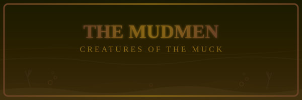
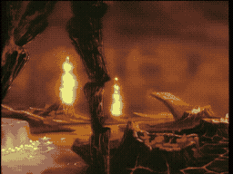

# THE MUDMEN

**Creatures of the Muck**

*   **Species:** Animated mud / living sludge
*   **Location:** The Mist Room (subterranean caves)
*   **Abilities:** Assimilation, Multiplication, Slime Projection
*   **Weakness:** Speed -- they cannot keep up with a moving target
*   **Danger Level:** Extreme -- far too strong to fight directly

---

### Born from the Swamp

Deep in the subterranean caves beneath Singe's castle, where boiling lava meets stagnant swamp water, the Mudmen dwell. They are not truly alive -- at least, not in any way that makes sense. They are animated sludge, shambling masses of mud and muck that rise from the ground to engulf anything that moves.

The worst part? They can assimilate their prey. Any creature dragged beneath the surface becomes one of them -- another mindless mud horror, forever trapped in the mire. This is how they multiply: not by breeding, but by consuming.

### A Tide of Filth

The Mudmen never speak. They never hesitate. They simply rise, spread, and engulf. They attack in groups, strategically blocking escape routes with their shapeless bodies. Despite their muddy composition, they move with surprising speed when they sense prey. Their slime can slow you to a crawl, and their grip is far stronger than it looks.

Even Dirk's sword is of limited use here. The old trading cards describe them as creatures "far too strong to be fought" -- avoidance is the only real option.

### Escape the Mire

This is not a battle. It is a desperate scramble for survival. The caves are filled with geysers of goo, pools of bubbling mud, and the ever-present reaching hands of the Mudmen.

**Strategy:** Do NOT stand and fight! The Mudmen cannot be defeated by the sword -- there are simply too many, and more will rise from every puddle. Keep moving, jump over their grasping arms, and find the exit before the entire floor comes alive beneath your feet!
