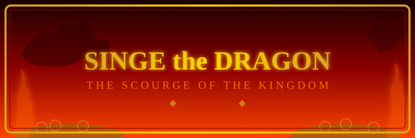

# SINGE THE DRAGON

**The Scourge of the Kingdom**

*   **Species:** Dragon (Ancient)
*   **Height:** Massive -- towers over a grown knight
*   **Abilities:** Fire Breath, Crushing Tail, Razor Claws
*   **Skin:** Green scales, purple horns and dorsal fin, yellowish underbelly
*   **Distinguishing Marks:** Covered in warts; sharp fangs; spiked tail
*   **Hoard:** Mountains of gold coins and gems (and one Princess)
*   **Weakness:** The enchanted sword Dragonfang

---

### The Terror of the Deep

Singe is the undisputed master of the castle and the most feared creature in the realm. He has claimed the deepest chambers as his lair, where he sleeps atop enormous piles of stolen gold, his breath hot enough to melt the coins beneath him. Knights, princes, and heroes beyond counting have entered his domain. None have returned.

By the command of the dark wizard Mordroc, Singe kidnapped Princess Daphne and sealed her within an unbreakable magic bubble deep in his treasure chamber. King Ethelred was given an ultimatum: surrender his entire kingdom by sunset, or the Princess would perish.

### Beware His Fury

Do not be fooled by his slumber. Singe is a light sleeper, and the faintest sound will rouse him to terrible rage. His fire breath can reduce a knight to ashes in an instant, and his claws and tail strike with devastating force. Despite his enormous bulk, he moves with surprising speed -- many a hero's last mistake was assuming they could outrun him.

### The Key to Victory

Look closely: strung around Singe's neck hangs a golden key -- the only way to shatter Daphne's magical prison. And buried somewhere in his hoard of gold lies the enchanted sword Dragonfang, the one weapon that can pierce a dragon's hide. You must find the blade and strike true. There will be no second chance.

**Strategy:** Singe cannot be defeated by brute force or common steel. Dodge his fire, use the stone pillars for cover, and search the gold for the magic sword. One well-aimed strike is all it takes -- but getting that chance may be the hardest thing you ever do!
