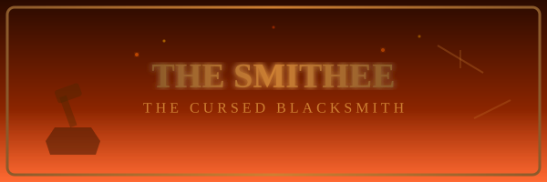

# THE SMITHEE

**The Cursed Blacksmith**

*   **True Nature:** An enchanted bronze statue
*   **Location:** The Forge
*   **Weapons:** Magic hammer, red-hot tongs, flying swords, enchanted armor
*   **Origin:** A master blacksmith cursed by two sorcerers
*   **Temper:** Volcanic

---

### The Legend of the Forge

Long before Singe claimed this castle, a master blacksmith worked these forges. He was the finest metalworker in all the land -- kings and warlords alike sought his craft. But the Smithee's skill was not entirely his own. Two powerful sorcerers, Dagda and Morrigu, had gifted him a magical hammer that could turn ordinary metal into gold, and an enchanted flame that could breathe life into metal and stone.

The gifts were meant for noble purposes. The Smithee had other ideas. Consumed by ambition, he began forging weapons of terrible power -- enchanted blades and living armor that would make him a king. When the sorcerers discovered his treachery, their punishment was swift and absolute: they transformed the Smithee into a bronze statue, cursed to stand eternal guard over his enchanted weapons, never to wield them, never to rest.

### The Awakening

But the curse has a flaw. When an intruder enters the forge, the Smithee animates -- his bronze form lurching to life with a grinding screech. And his enchanted weapons awaken with him. Swords fly from the walls. Hammers swing themselves. Red-hot tongs lunge through the air. The forge becomes a whirlwind of deadly metal, all of it aimed at you.

### The Only Way Out

The Smithee cannot be reasoned with. He is rage and bronze and cursed magic. But a true strike from a noble knight's sword can de-animate him, sending the statue crashing back into frozen silence -- at least until the next intruder arrives.

**Strategy:** The weapons have a mind of their own -- watch for flying swords, dodge the hammers, and when you see your opening, strike the Smithee himself! One clean hit will end the chaos. You will face this room twice -- once from each direction.
