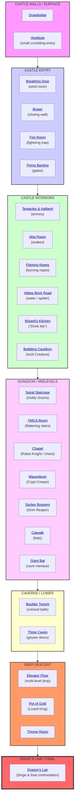

# CASTLE MAP OVERVIEW

```mermaid
graph TD
    subgraph Surface [CASTLE WALLS / SURFACE]
        Drawbridge["<a href='usermanual-scene-001.md'>Drawbridge</a>"]
        Vestibule["<a href='usermanual-scene-002.md'>Vestibule</a><br>(small crumbling entry)"]
    end

    subgraph Entry [CASTLE ENTRY]
        BreathingDoor["<a href='usermanual-scene-009.md'>Breathing Door</a><br>(wind room)"]
        Bower["<a href='usermanual-scene-004.md'>Bower</a><br>(closing wall)"]
        FireRoom["<a href='usermanual-scene-005.md'>Fire Room</a><br>(lightning trap)"]
        FlyingBarding["<a href='usermanual-scene-016.md'>Flying Barding</a><br>(gates)"]
    end

    subgraph Interiors [CASTLE INTERIORS]
        Tentacles["<a href='usermanual-scene-008.md'>Tentacles & Halberd</a><br>(armory)"]
        MistRoom["<a href='usermanual-scene-003.md'>Mist Room</a><br>(snakes)"]
        FlamingRopes["<a href='usermanual-scene-015.md'>Flaming Ropes</a><br>(burning ropes)"]
        YBR["<a href='usermanual-scene-025.md'>Yellow Brick Road</a><br>(water / spider)"]
        DrinkMe["<a href='usermanual-scene-020.md'>Wizard’s Kitchen</a><br>(“Drink Me”)"]
        Cauldron["<a href='usermanual-scene-017.md'>Bubbling Cauldron</a><br>(Acid Creature)"]
    end

    subgraph Midlevels [DUNGEON / MIDLEVELS]
        GiddyGoons["<a href='usermanual-scene-010.md'>Spiral Staircase</a><br>(Giddy Goons)"]
        TiltingRoom["<a href='usermanual-scene-007.md'>YMCA Room</a><br>(flattening stairs)"]
        RobotKnight["<a href='usermanual-scene-021.md'>Chapel</a><br>(Robot Knight / chess)"]
        CryptCreeps["<a href='usermanual-scene-019.md'>Mausoleum</a><br>(Crypt Creeps)"]
        GrimReaper["<a href='usermanual-scene-024.md'>Socker Boppers</a><br>(Grim Reaper)"]
        CatwalkBats["<a href='usermanual-scene-011.md'>Catwalk</a><br>(bats)"]
        GiantBat["<a href='usermanual-scene-018.md'>Giant Bat</a><br>(cave menace)"]
    end

    subgraph Caverns [CAVERNS / LOWER]
        RollingBalls["<a href='usermanual-scene-013.md'>Boulder Trench</a><br>(colored balls)"]
        UndergroundRiver["<a href='usermanual-scene-014.md'>Three Caves</a><br>(geyser doors)"]
    end

    subgraph Deep [DEEP DESCENT]
        ElevatorFloor["<a href='usermanual-scene-012.md'>Elevator Floor</a><br>(multi-level drop)"]
        LizardKing["<a href='usermanual-scene-027.md'>Pot of Gold</a><br>(Lizard King)"]
        ThroneRoom["<a href='usermanual-scene-006.md'>Throne Room</a>"]
    end

    subgraph Final [SINGE’S LAIR / FINAL]
        DragonsLair["<a href='usermanual-scene-028.md'>Dragon’s Lair</a><br>(Singe & final confrontation)"]
    end

    Surface --> Entry
    Entry --> Interiors
    Interiors --> Midlevels
    Midlevels --> Caverns
    Caverns --> Deep
    Deep --> Final

    style Surface fill:#f9f,stroke:#333,stroke-width:2px
    style Entry fill:#ccf,stroke:#333,stroke-width:2px
    style Interiors fill:#cfc,stroke:#333,stroke-width:2px
    style Midlevels fill:#fcf,stroke:#333,stroke-width:2px
    style Caverns fill:#ffc,stroke:#333,stroke-width:2px
    style Deep fill:#f96,stroke:#333,stroke-width:2px
    style Final fill:#f66,stroke:#333,stroke-width:4px
```
