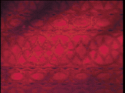

# CONTROLS & SECRETS

## Arcade Controls

In this FMV adventure, you do not move Dirk freely around the screen. Instead, you guide him through the movie by pressing the correct direction or the sword button at the **precise moment**. One input at the right time is all it takes -- but miss the window, and Dirk pays the price.

### The Inputs

*   **Control Pad (D-Pad):** Used for movement and directional reactions.
    *   **Up:** Move Forward / Climb Up / Grab Top Rope / Enter Door
    *   **Down:** Duck / Crouch / Climb Down / Back Away
    *   **Left:** Move Left / Jump Left / Dodge Left
    *   **Right:** Move Right / Jump Right / Dodge Right
*   **Buttons (A, B, X, Y):** All four face buttons function as the **SWORD**.
    *   Press any button to Swing Sword / Attack / Draw Weapon.
*   **Start:** Pause the game. The pause screen shows your current scene, score, lives, and credits.
*   **Select:** Insert Coin (from the title screen or Game Over screen).

---

## The "Flash" System

The game gives you a split-second cue by flashing **yellow** on the screen to show you what to do:

*   **Yellow Flash on a Door, Path, or Wall:** Move in that direction (Up, Down, Left, or Right).
*   **Yellow Flash on Dirk or his Sword:** Press the Sword button immediately to attack!

**Timing is Key:** Do not mash buttons! Press the button *once*, decisively, when you see the cue or anticipate the danger. Mashing will cause Dirk to act at the wrong moment and get himself killed.

---

## Lives, Credits & Scoring

Just like the original 1983 arcade, you need credits to play!

*   Press **Select** to insert a coin at the title screen or continue screen.
*   Each credit grants you **5 lives**.
*   Each successful reaction earns you points. Chain together perfect reactions for higher scores!
*   When all lives are lost, you can continue from the last checkpoint by inserting another credit.
*   Your high scores are saved and displayed on the High Scores screen in the Options menu.

---

## Game Modes

Select your mode from the main menu. All modes share lives, credits, and scoring.

### Arcade Mode

The classic Dragon's Lair experience. Battle through 13 randomized scenes, then face Singe the Dragon in the finale. Each playthrough shuffles the scene order, so you never know what's coming next.

### Boss Rush

Major creature encounters only. 5 randomized scenes in an endless loop. Giant bats, grim reapers, lizard kings -- how long can you survive the castle's deadliest inhabitants?

### Oops, All Traps!

Environmental hazards only. 7 randomized scenes in an endless loop. Flaming ropes, tilting rooms, rolling boulders -- a fever dream high score gauntlet with no bosses in sight.

---

## Secrets

### The Konami Code

Run out of credits? Frustrated by the castle's difficulty? At the **Game Over / Continue** screen, enter the legendary code:

**UP, UP, DOWN, DOWN, LEFT, RIGHT, LEFT, RIGHT, B, A**

*Effect: Grants 30 Credits instantly!*

### Scene Select

From the title screen, enter **Options** and navigate to **Scene Select**. Use Left and Right to choose any of the 29 scenes and press A to jump directly to it. Perfect for practicing that one room that keeps defeating you.

### Attract Mode

Let the title screen sit idle and the Attract Mode will play automatically -- a cinematic preview of Dirk's adventure. Watch carefully: the attract mode shows real gameplay footage and often reveals the correct reactions to the game's deadliest traps!
