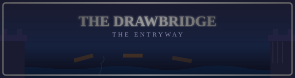

# SCENE 1: THE DRAWBRIDGE

**The Entryway**

The adventure begins here. Dirk arrives at the gates of Singe's castle to find the drawbridge already retracting -- its massive wooden planks splitting apart and plunging into the tentacle-infested moat below. The castle itself seems to know you are coming, and it does not intend to let you in easily.

Strange, eyeless creatures lurk in the dark waters beneath the bridge, their slimy appendages reaching upward through the gaps. The great iron portcullis at the far end grinds downward, threatening to seal the entrance forever.

*   **Threat:** The bridge planks are falling away beneath your feet, and the door is slamming shut. Tentacle creatures rise from the moat below.
*   **Action:** Jump across the widening gaps! If the bridge raises completely, look for a rope to swing across. Move fast -- hesitation here means a swim with the tentacles.
*   **Tip:** This is your very first test. Watch the animation closely for your cue to move. The yellow flash tells you WHEN to act!
