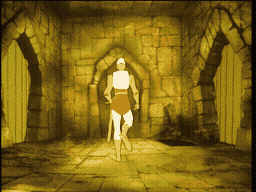

# SCENE 2: THE VESTIBULE

**The Crumbling Hall**

Dirk barely makes it through the castle doors before the vestibule begins to collapse around him. Massive stone blocks rain from the ceiling, the floor cracks and gives way, and through the dust and chaos, a knight statue at the far end of the hall suddenly springs to life -- sword raised and ready to strike.

This is no ordinary entrance hall. Mordroc's magic has turned the very architecture into a weapon. Every pillar, every flagstone, every ornamental suit of armor is a potential death trap.

*   **Threat:** Falling debris from the crumbling ceiling. A hostile animated knight statue blocks the exit.
*   **Action:** Dodge the falling rubble -- the safe path is to the right! Then brace yourself to parry the knight statue's attack before it cuts you down.
*   **Tip:** The vestibule teaches you the two core skills of the game: dodging obstacles with directional input and attacking enemies with your sword. Master these, and you have a chance.
