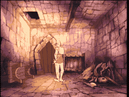

# SCENE 5: THE FIRE ROOM

**Inferno**

The heat hits you before you even see the flames. The Fire Room is a furnace of magical fire -- jets of flame erupt from the walls, the floor glows with molten heat, and rivers of fire course through channels carved into the stone. This is not natural flame -- it burns in patterns, cycling on and off with an almost rhythmic pulse.

The castle's enchantments fuel these fires, and they will never run out. The only way through is to read the pattern and move between the bursts.

*   **Threat:** Walls of magical flame erupt from floor and ceiling. The ground itself burns. Fire jets sweep across the room in deadly patterns.
*   **Action:** Jump between the safe platforms! Watch the pattern of the fire bursts -- there is a rhythm to the chaos. Time your movements to the gaps between the flames.
*   **Tip:** Patience is key in the Fire Room. Do not rush through blindly. Watch the fire cycle once, learn the pattern, and then move with confidence.
