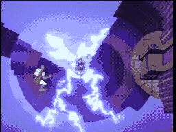

# SCENE 6: THE THRONE ROOM

**The King's Seat**

A magnificent golden throne sits at the end of a grand hall, bathed in an eerie light. It looks regal, inviting even -- the kind of seat a weary knight might be tempted to rest in after battling through the castle's horrors. That temptation is exactly the trap.

The throne crackles with hidden electrical energy. An invisible force pulls anyone who enters the room toward the seat, drawing them closer and closer. Those who sit in it are electrocuted instantly.

*   **Threat:** The throne is electrified with lethal voltage! A magnetic force pulls you toward it. Sitting down means instant death.
*   **Action:** Do NOT sit down! Resist the pull and find another way out of the room. Fight the invisible force dragging you toward the throne.
*   **Tip:** Everything about this room is designed to lure you to the throne. The safe path is to avoid it entirely. Look for the exit, not the seat.
