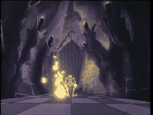

# SCENE 7: THE TILTING ROOM

**Unstable Ground**

The floor of this room is mounted on a central pivot, tilting violently from side to side like the deck of a ship in a storm. Below the floor, molten lava churns and bubbles, waiting to swallow anything that slides off the edge. The room lurches without warning, sending furniture, debris, and knights tumbling toward the glowing abyss.

Gravity itself has become your enemy. Every step is a fight to stay upright, every shift of the floor a potential death sentence.

*   **Threat:** The floor tilts wildly, sliding you toward pools of molten lava. Gravity and momentum work against you constantly.
*   **Action:** Run to the high side of the room as it tilts! Keep moving to maintain your balance. When the floor shifts, shift with it -- always stay uphill from the lava.
*   **Tip:** The tilting follows a pattern. Once you recognize which direction the floor will shift next, you can anticipate and move before gravity takes hold.
