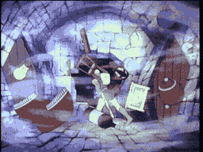

# SCENE 9: THE BREATHING DOOR

**It's Alive!**

The corridor ahead narrows to a single doorway -- but this is no ordinary door. It pulses. It heaves. It inhales and exhales with the slow, terrible rhythm of something enormous breathing. With each inhalation, a gale-force wind howls through the corridor, dragging everything toward the gaping maw. With each exhalation, a blast of foul air pushes you back.

This is one of the castle's most bizarre and unsettling rooms. The door itself appears to be alive -- or at least enchanted with a hunger of its own. Those who are sucked through never come back.

*   **Threat:** The living door inhales with tremendous force, pulling you toward it. If you are swallowed, there is no escape.
*   **Action:** Run AWAY from the door during its inhale phase! Use the exhale to push yourself further from its reach. Time your movements to the breathing cycle.
*   **Tip:** The Wind Room tests your nerve. Every instinct says to run through the door, but in this case, the door IS the danger. Find another way out.
