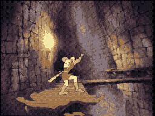

# SCENE 11: CATWALK BATS

**Highwire Act**

High above the castle floor, a narrow stone beam stretches across a yawning chasm. There is no railing, no rope, nothing to catch you if you fall. And to make matters worse, giant bats nest in the rafters above -- dark, leathery shapes with wingspans wider than Dirk is tall. They swoop and dive, trying to knock the knight off his precarious perch.

One wrong step, one missed dodge, and it is a long fall to the bottom.

*   **Threat:** Giant bats dive-bomb from above, trying to knock you off the narrow beam into the abyss below. One hit and you lose your balance.
*   **Action:** Swat the bats away with your sword or duck under their attacks while keeping your footing. Balance and timing are everything.
*   **Tip:** Do not try to fight every bat. Some can be dodged by ducking or leaning. Save your sword swings for the ones coming straight at you, and keep moving across the beam.
