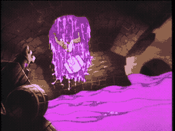

# SCENE 14: UNDERGROUND RIVER

**Whitewater Peril**

Deep beneath the castle, an underground river rages through a cavern of jagged stone. Dirk finds himself in a small wooden boat -- barely more than a barrel, really -- careening through churning rapids. Massive boulders jut from the water, the current throws the vessel from side to side, and somewhere ahead, the ominous roar of a whirlpool grows louder.

There is no stopping, no turning back. The river carries you forward whether you like it or not. All you can do is steer and pray.

*   **Threat:** Churning rapids, jutting boulders, and massive whirlpools that will suck your vessel to the bottom. The current is relentless.
*   **Action:** Steer your boat left and right to avoid the rocks! When you hear the whirlpool, steer AWAY -- hard and fast. Do not let the current pull you in.
*   **Tip:** The river has a flow pattern. Rocks appear in sequences -- left, right, center. Learn the sequence and steer preemptively rather than reactively.
