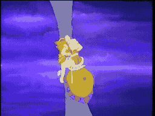

# SCENE 16: FLYING BARDING

**Possessed Armor**

In a chamber deep within the castle, a suit of horse armor -- a barding -- hangs from the wall. It looks decorative, harmless. Then its eyes begin to glow. With a screech of metal against stone, the enchanted armor tears itself free and takes flight, swooping through the chamber like a furious iron ghost.

The Flying Barding is one of the castle's most unpredictable foes. It charges through the air, banks off walls, and dives at Dirk with the weight and speed of a charging warhorse -- except this one can fly. Dirk must ride the cursed steed through walls of fire and deadly obstacles, holding on for dear life.

*   **Threat:** The possessed horse armor flies at incredible speed, charging and trampling anything in its path. Walls of fire block your escape.
*   **Action:** Dodge its swooping charges! When it passes close enough, strike with your sword. You may need to ride it through the gauntlet of fire.
*   **Tip:** The Barding follows attack patterns -- watch where it banks after each charge to predict where it will come from next. Stay mobile and strike when it passes.
