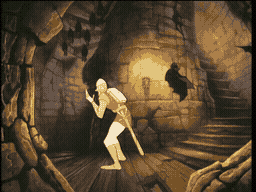

# SCENE 18: GIANT BAT

**Winged Terror**

The cavern opens into a massive underground dome, and clinging to the ceiling is something terrible -- a bat of monstrous proportions, its wingspan filling the entire chamber. Its eyes gleam in the darkness, and when it drops from its perch, the downdraft of its wings nearly knocks Dirk off his feet.

This is no ordinary creature. The Giant Bat is one of Singe's most fearsome guardians, a beast bred in the deepest caves of the castle. Its fangs are as long as daggers, and its talons can crush stone. Fighting it head-on would be suicide.

*   **Threat:** The Giant Bat swoops, bites, and slashes with enormous talons. Its wingspan blocks escape routes, and its shrieks can disorient you.
*   **Action:** You cannot fight this creature head-on -- it is simply too massive. Dodge its diving attacks and slash at its wings when they sweep within reach. Aim for the vulnerable wing membranes.
*   **Tip:** The bat always pulls up after a dive. That moment -- when it banks upward and its wings spread wide -- is your window to strike. Slash fast, then dodge the next dive.
