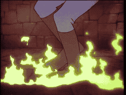

# SCENE 20: DRINK ME ROOM

**A Questionable Potion**

The room is quiet. Eerily quiet. After the gauntlet of horrors behind you, this chamber feels almost peaceful -- just a simple table in the center of an empty room, with a small glass bottle sitting upon it. A label reads: "DRINK ME."

It could be poison. It could be a transformation potion. It could be the key to everything. The castle is full of Mordroc's twisted enchantments, and this room has all the hallmarks of a trap designed for the curious. But in a castle where every door, every floor, and every piece of furniture has tried to kill you, perhaps a mysterious potion is the least of your worries.

*   **Threat:** The potion's effects are unknown. Is it poison? A shrinking elixir? A transformation curse? The room itself may have hidden dangers triggered by your choice.
*   **Action:** Drink if you dare -- but be ready for whatever happens next! The consequences of this room are unpredictable.
*   **Tip:** In Dragon's Lair, inaction can be just as deadly as the wrong action. Sometimes you must take the leap of faith. Just be ready to react to whatever comes next.
