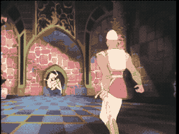

# SCENE 21: THE ROBOT KNIGHT

**Automated Guard**

The passage ahead is blocked by a figure of gleaming metal -- not a suit of armor worn by a man, but a mechanical construct, a knight built entirely from enchanted machinery. Its joints hiss with steam, its eyes glow with an unnatural light, and electrical arcs crackle across the tiled floor at its feet.

The Robot Knight is one of Mordroc's finest creations: a tireless, fearless guardian that never sleeps, never tires, and never shows mercy. It swings its electrified weapon with devastating precision, and the floor panels around it are wired to deliver crippling shocks to anyone who steps on the wrong tile.

*   **Threat:** The Robot Knight attacks with an electrified weapon and activates electric floor panels. It is heavily armored, relentless, and does not fatigue.
*   **Action:** Dodge its heavy swings and avoid the electrified floor tiles! Look for gaps in its attack pattern -- even machines have timing weaknesses. Find the weak point in its mechanisms.
*   **Tip:** The Robot Knight telegraphs its attacks with a whirring sound as its arm cocks back. Listen for the sound and dodge BEFORE the swing. The electric tiles have a visible flicker before they activate.
