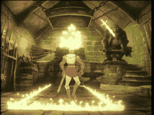

# SCENE 22: THE SMITHEE

**The Forge**

The ring of hammer on anvil echoes through the corridor long before you reach the forge. Inside, a bronze statue of a blacksmith stands over a roaring furnace -- but this is no mere decoration. The Smithee was once a master craftsman, cursed by the sorcerers Dagda and Morrigu for using their magical gifts to forge weapons of conquest. Transformed into living bronze, he is condemned to guard his enchanted creations for eternity.

The moment Dirk enters, the statue lurches to life with a grinding screech. And so do the weapons. Swords fly from the walls. Hammers swing themselves through the air. Red-hot tongs lunge at you from every direction. The entire forge is a whirlwind of enchanted, deadly metal.

*   **Threat:** The Smithee attacks with his magic hammer while enchanted weapons -- swords, maces, anvils, and red-hot tongs -- fly at you from every direction.
*   **Action:** Dodge the flying weapons and close the distance! One clean strike from your sword will de-animate the Smithee, sending him crashing back into frozen silence.
*   **Tip:** Focus on the Smithee himself, not the flying weapons. They are distractions. Time your approach between the flying hazards and strike the statue directly.
