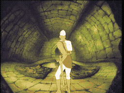

# SCENE 25: YELLOW BRICK ROAD

**Not Kansas**

A path of cheerful yellow bricks stretches ahead, winding deeper into the castle. It looks almost inviting -- bright, colorful, a welcome contrast to the gloom and horror of the surrounding chambers. Do not be fooled. This is Mordroc's idea of a joke.

The yellow bricks crumble beneath your feet without warning, revealing spike pits below. Magical traps trigger as you pass, sending jets of flame, bolts of energy, and worse erupting from the walls. The pretty colors are camouflage for one of the most treacherous corridors in the entire castle.

*   **Threat:** Crumbling bricks hide spike pits. Magical traps fire from the walls. The entire colorful path is one long gauntlet of deception.
*   **Action:** Watch your step! Test the path ahead before committing. The pretty colors hide deadly pitfalls -- trust nothing that looks safe in this castle.
*   **Tip:** The crumbling bricks have a slightly different shade from the solid ones. Look closely and step only on the bricks that are firmly set. When in doubt, move fast -- a moving target is harder for the wall traps to hit.
