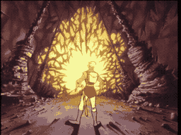

# SCENE 26: THE BLACK KNIGHT

**The Duel**

A bolt of lightning splits the air, striking Dirk's sword and sending sparks flying. From the shadows charges the Black Knight -- a towering figure in jet-black armor astride a massive dark warhorse, greatsword raised for the kill. Giant thorns erupt from the ground, cutting off any retreat. This is a duel to the death, and the Black Knight has no intention of losing.

The Phantom Knight is said to be a champion of the old court, enslaved by Mordroc's dark magic and cursed to guard these passages for eternity. His armor is impervious to normal attacks, his horse is relentless, and the room itself is rigged with electrical hazards that crackle across the floor.

*   **Threat:** Heavy greatsword attacks from horseback. Giant thorns block retreat. Electrical shocks course through the floor. The Knight's armor is nearly impervious.
*   **Action:** Parry his sword blows and wait for an opening! The room's electrical hazards are deadly, but they may be the key to his defeat. Stay mobile and time your strikes perfectly.
*   **Tip:** The Black Knight charges in patterns. After each pass, he wheels his horse around -- that turn is your window. Strike at the seams of his armor and use the room's own dangers against him.
