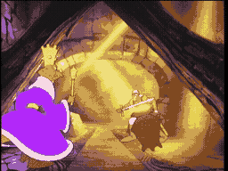

# SCENE 27: THE LIZARD KING

**The Treasury**

You enter a vault piled high with stolen gold -- and the moment you step inside, an enchanted pot of gold magnetically rips your sword right out of your hands and bolts down the corridor with it. Before you can react, a hissing laugh echoes behind you. The Lizard King has arrived.

Draped in purple robes and a golden crown, this hulking reptilian warlord is Singe's most trusted lieutenant. His yellow eyes burn with greed and malice as he raises his golden scepter overhead. What follows is a frantic chase through winding corridors -- you sprinting after your stolen sword while the Lizard King thunders behind, swinging his scepter at every turn.

*   **Threat:** Your sword is stolen by the enchanted pot of gold! The Lizard King chases you with his devastating scepter. One hit will flatten you. The gold-slicked floors are treacherous.
*   **Action:** Chase the pot of gold to reclaim your sword! At each intersection, choose the right path or be caught. Once armed, turn and fight -- but be ready to lose your weapon again.
*   **Tip:** The pot of gold always turns just before the Lizard King catches up. Watch which direction it goes at each junction and follow immediately. Do not hesitate at intersections -- the Lizard King is right behind you.
