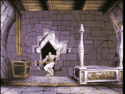
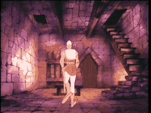
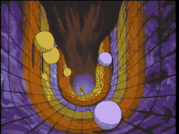
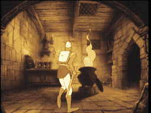
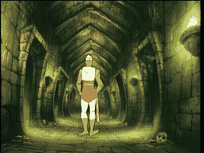
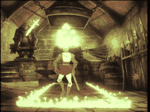
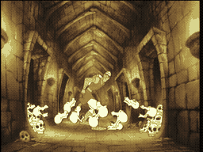

# SCENE GUIDE: THE ADVENTURE

Here is a guide to the 29 perils you will face in Singe's Castle. Study well, brave knight -- your life depends on it.

---

## 1. The Drawbridge

**Threat:** The bridge is collapsing beneath your feet! Tentacles rise from the moat.
**Action:** Jump across the gaps or grab onto the ropes. [See Scene 1](usermanual-scene-001.md)

## 2. The Vestibule

**Threat:** Collapsing ceiling and an animated knight statue.
**Action:** Dodge the debris and parry the knight's attack. [See Scene 2](usermanual-scene-002.md)

## 3. The Mist Room

**Threat:** Mudmen rising from the swamp to drag you down.
**Action:** Keep moving -- do not let them grab you! [See Scene 3](usermanual-scene-003.md)

## 4. The Bower

**Threat:** A peaceful room... until the ceiling crashes in!
**Action:** Dodge falling debris in every direction. [See Scene 4](usermanual-scene-004.md)

## 5. The Fire Room

**Threat:** Magical fire erupts from walls and floor.
**Action:** Jump between the safe platforms. Watch the fire pattern! [See Scene 5](usermanual-scene-005.md)

## 6. The Throne Room

**Threat:** The electrified throne pulls you toward it!
**Action:** Do NOT sit down! Find another way out. [See Scene 6](usermanual-scene-006.md)

## 7. The Tilting Room

**Threat:** The floor tilts wildly, sliding you into lava.
**Action:** Run to the high side! Keep moving. [See Scene 7](usermanual-scene-007.md)

## 8. The Tentacle Room

**Threat:** Giant purple tentacles strike from the ceiling.
**Action:** Slice them with your sword before they grab you! [See Scene 8](usermanual-scene-008.md)

## 9. The Breathing Door

**Threat:** The living door inhales with terrifying force.
**Action:** Run AWAY! Do not let it swallow you. [See Scene 9](usermanual-scene-009.md)

## 10. The Giddy Goons

**Threat:** Small, cackling creatures with daggers swarm the staircase.
**Action:** Fight them off with your sword. Do not stop! [See Scene 10](usermanual-scene-010.md)

## 11. Catwalk Bats

**Threat:** Giant bats swoop down on a narrow walkway.
**Action:** Swat them away while keeping your balance! [See Scene 11](usermanual-scene-011.md)

## 12. Elevator Floor

**Threat:** Floor sections rise and fall unpredictably.
**Action:** Jump to the next platform at the right moment. [See Scene 12](usermanual-scene-012.md)

## 13. Rolling Balls

**Threat:** Giant colorful balls rolling down the hallway.
**Action:** Jump or dodge! Different sizes need different tactics. [See Scene 13](usermanual-scene-013.md)

## 14. Underground River

**Threat:** Churning rapids, boulders, and whirlpools.
**Action:** Steer your boat to safety. Avoid the whirlpools! [See Scene 14](usermanual-scene-014.md)

## 15. Flaming Ropes

**Threat:** Every rope ignites the moment you touch it!
**Action:** Swing fast! Jump to the next rope before you burn. [See Scene 15](usermanual-scene-015.md)

## 16. Flying Barding

**Threat:** Possessed horse armor that flies and charges.
**Action:** Dodge its swooping attacks and ride the gauntlet of fire. [See Scene 16](usermanual-scene-016.md)

## 17. Bubbling Cauldron

**Threat:** A giant cauldron of boiling green slime. Acid creatures emerge.
**Action:** Do NOT fall in! Navigate the rim carefully. [See Scene 17](usermanual-scene-017.md)

## 18. Giant Bat

**Threat:** A massive bat with fangs like daggers.
**Action:** Dodge its dives and slash at its wings! [See Scene 18](usermanual-scene-018.md)

## 19. Crypt Creeps

**Threat:** Ghouls crawl from coffins. Bouncing skulls and insects swarm.
**Action:** Sword them back to the grave! Be aggressive. [See Scene 19](usermanual-scene-019.md)

## 20. Drink Me Room

**Threat:** A mysterious potion labeled "Drink Me."
**Action:** Dare you drink it? Be ready for the consequences! [See Scene 20](usermanual-scene-020.md)

## 21. The Robot Knight

**Threat:** A mechanical warrior with electric attacks.
**Action:** Dodge its swings and find the weak point. [See Scene 21](usermanual-scene-021.md)

## 22. The Smithee

**Threat:** The cursed blacksmith and his flying enchanted weapons.
**Action:** Dodge the tools and strike the Smithee himself! [See Scene 22](usermanual-scene-022.md)

## 23. The Smithee (Reversed)

**Threat:** Same cursed blacksmith, everything mirrored!
**Action:** Reverse your instincts. Left is right, right is left. [See Scene 23](usermanual-scene-023.md)

## 24. The Grim Reaper

**Threat:** Death himself guards a narrow bridge. One touch is fatal.
**Action:** Slip past the whirling batons, strike, and RUN from the thorns! [See Scene 24](usermanual-scene-024.md)

## 25. Yellow Brick Road

**Threat:** Crumbling bricks, spike pits, and magical traps.
**Action:** Watch your step! The pretty colors hide deadly pitfalls. [See Scene 25](usermanual-scene-025.md)

## 26. The Black Knight

**Threat:** A phantom knight on horseback with electrical hazards.
**Action:** Parry his blows and use the room against him! [See Scene 26](usermanual-scene-026.md)

## 27. The Lizard King

**Threat:** Your sword is stolen! The Lizard King chases you with his scepter.
**Action:** Chase the pot of gold, reclaim your sword, and fight back! [See Scene 27](usermanual-scene-027.md)

## 28. The Dragon's Lair

**Threat:** SINGE THE DRAGON. The final battle.
**Action:** Find the magic sword. Slay the dragon. Free the Princess! [See Scene 28](usermanual-scene-028.md)

## 29. Attract Mode

**Threat:** None -- sit back and watch!
**Action:** Study the attract mode for clues to the game's toughest traps. [See Scene 29](usermanual-scene-029.md)
